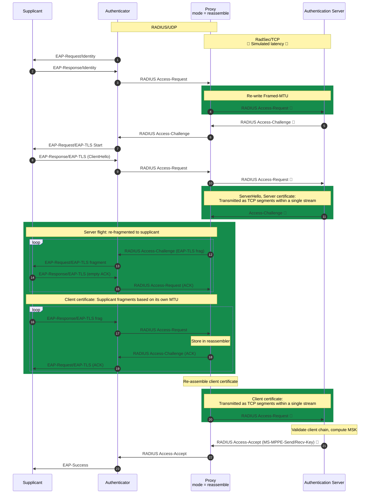
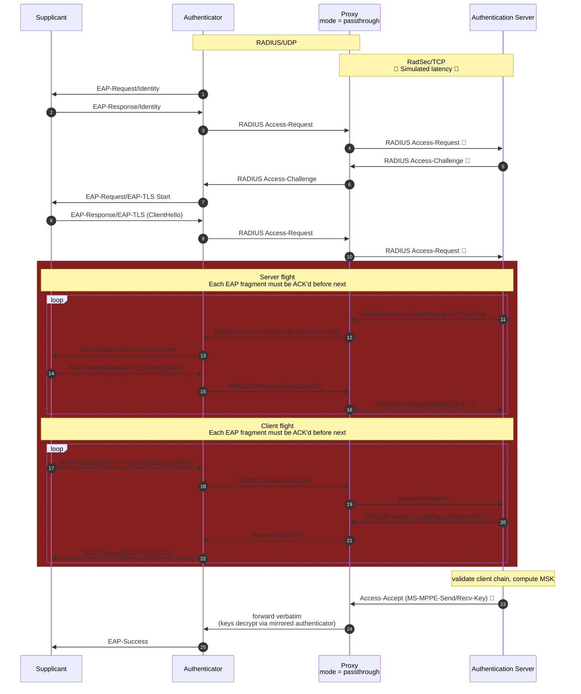
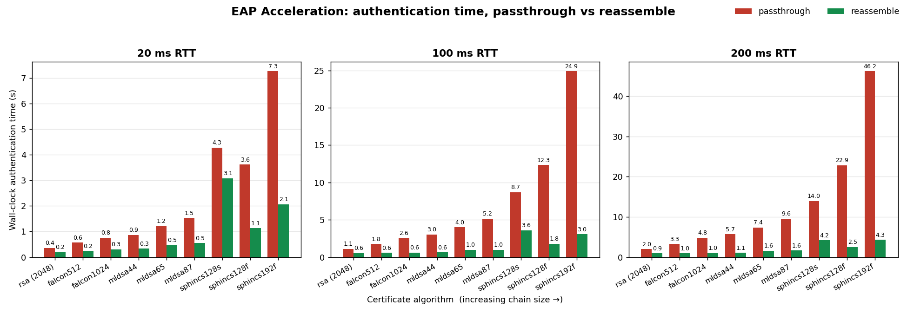
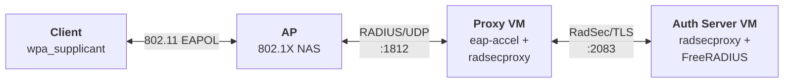
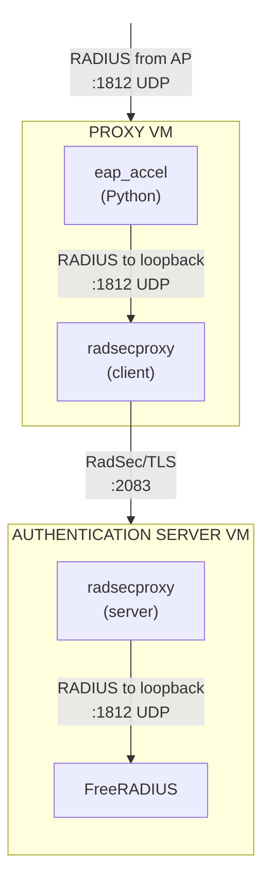
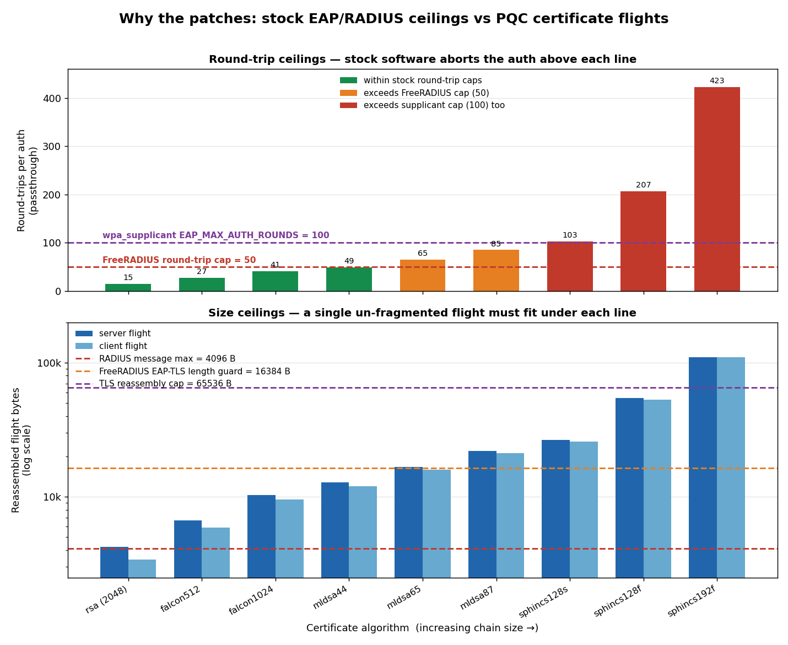

# EAP Acceleration

## Overview

This repository demonstrates EAP Acceleration: a proposed solution to address the impact of Post-Quantum Cryptography (PQC) on 802.1X/EAP-TLS due to increased certificate sizes.

In addition to a description of the solution and initial test results, instructions and code required to deploy a complete testbed are included.

## The challenge 

Post-Quantum Cryptography (PQC) introduces certificate sizes that are untenable using current EAP transport mechanisms, which require the delivery of small fragments over a large number of round-trips. Due to the high number of round-trips, even a small increase in latency between the Supplicant and Authentication Server can have a catastrophic impact.

Many of the proposed solutions to address this challenge involve reducing the size of the TLS handshake or eliminating it under certain circumstances.

In contrast, EAP Acceleration focuses on the underlying transport, and moving the large PQC certificate exchanges off the legacy 'slow path' and onto a modern 'fast path' before it has to traverse a higher-latency link.

Addressing the problem at the transport layer provides a reliable fallback, should any of the upper-layer solutions fail at any point due to issues with the Supplicant or Server.
In ideal circumstances, these proposed solutions would be used in conjunction as a layered approach to optimise authentication time.

EAP is a lock-step protocol (RFC 3748 §3.1): only one packet may be in flight at a time, and each message is implicitly acknowledged before the next one is sent. This is inherent to EAP itself, independent of whatever transport carries it.
It is this lock-step behaviour (what we will call the 'slow path') that forces a round-trip per EAP message.

RadSec (RADIUS over TLS) utilises TCP as its mechanism for reliable delivery, and has the added benefit of being able to transmit a large RADIUS message in multiple TCP segments, avoiding IP fragmentation (what we will call the 'fast path').

Although RadSec is widely available and deployed as a transport for EAP, the 'acknowledge every EAP message' constraint still applies to the inner payload.

## Proposed solution

At a high-level, the proposed EAP Acceleration method involves three things:

1) Sending certificates in a single un-fragmented EAP-TLS message, carried as a stream of TCP segments over as much of the link as possible

2) Fragmenting large server certificate payloads on the last L2 leg towards the supplicant 

3) Locally acknowledging and re-assembling small client certificate fragments on the first L2 leg from the supplicant

The result is for most of the journey, including the potentially latent path from the Authenticator to the Authentication server, the large certificate flights behave like most other traffic on the Internet. This means that in most cases, larger certificate sizes do not require more round-trips across the latent links, and latency is a much smaller factor than it otherwise would be.


## How it works

The steps below describe **reassemble** mode; passthrough forwards fragments verbatim — see the diagrams below.

1) The EAP Proxy re-writes the Framed-MTU in the RADIUS Access-Request from AP towards Authentication Server to `65000` bytes.

2) The Authentication Server uses this Framed-MTU value and its own matching `fragment_size` to determine the maximum EAP payload size it can use for sending the server flight containing the TLS server certificates.

3) The server flight contained in a single RADIUS Access-Request packet is split into multiple TCP segments to facilitate reliable delivery without requiring IP fragmentation.
   
4) The EAP Proxy receives the server flight and sends it to the AP in multiple EAP fragments based on the original Framed-MTU.

5) The EAP Proxy now receives the client certificate fragments, acknowledging each one and storing it locally for reassembly.

6) The EAP Proxy then transmits the re-assembled client certificate in a single RADIUS Access-Request packet, which is split into multiple TCP segments to facilitate reliable delivery without requiring IP fragmentation.

It is worth noting that many Authenticators can already perform an EAP Proxy function for the purpose of fragmenting at the EAP layer, to avoid IP fragmentation over Path-MTU constrained links (e.g. VPN tunnels) when using RADIUS over UDP.

## Authentication Flow: Reassemble Mode

The following diagram shows the end-to-end authentication flow with EAP Acceleration enabled:



## Authentication Flow: Passthrough Mode

The following diagram shows the end-to-end authentication flow without EAP Acceleration:



## Test Results

Each row is the mean of 3 authentications. **Chain bytes** is the reassembled
server flight (ServerHello … Certificate … ServerHelloDone), and **EAP frags**
is the total number of EAP-TLS fragments exchanged with the supplicant
(server→supplicant + supplicant→server). **RTT** is the latency `tc netem` adds
to the RadSec leg, set with the `latency` command. It is injected on a single
direction of that leg, so each upstream round-trip crosses the delayed direction
once and incurs it once — the column is therefore both the one-way delay and the
added round-trip latency. **Upstream
round-trips** counts the RADIUS request/response exchanges that actually cross
that latent leg.

Across every algorithm, passthrough's upstream round-trips scale with the
fragment count (and so does wall-clock as RTT grows), while reassemble holds at
**4 upstream round-trips** for any chain that fits a single un-fragmented RADIUS
message — the certificate flights cross the latent leg as one TCP stream rather
than dozens of acknowledged fragments. The only exception is
`sphincssha2192fsimple`, whose ~110 KB flight exceeds the maximum RADIUS message
size and must span two messages, lifting reassemble to a still-constant **6**.
The gap widens with both certificate size and latency: at 200 ms,
`sphincssha2192fsimple` drops from 46.2 s (passthrough) to 4.3 s (reassemble),
and even `mldsa87` drops from 9.6 s to 1.6 s.

Put as a rate: because each upstream round-trip pays that RTT once,
passthrough's wall-clock climbs by roughly its round-trip count for every
millisecond added to the RadSec leg — about 45 ms/ms for `mldsa87` and
216 ms/ms for `sphincssha2192fsimple` across the 20–200 ms range. Reassemble's
fixed 4–6 round-trips flatten that to 6–12 ms/ms, a 7–17× smaller latency
penalty.

Authenticating a 22 KB `mldsa87` chain with EAP Acceleration
costs about the same as a 4 KB `rsa` 2048 chain without it — and once the RadSec
leg has any real latency (≥100 ms), accelerated `mldsa87` is the faster of the
two.


One ordering caveat: SPHINCS+ comes in slow-but-small (`s`) and fast-but-large
(`f`) variants, so `sphincs128s` has a smaller chain than `sphincs128f` but much
slower signing/verification. At 20 ms that fixed compute cost dominates and
`128s` is slower despite the smaller cert; as RTT rises the per-fragment network
cost takes over and the bars return to chain-size order. This has a practical
consequence: because acceleration makes the larger flight nearly free, the fast
`f` variant authenticates faster than `s` at *every* latency in reassemble mode
(e.g. 1.1 s vs 3.1 s at 20 ms). The usual advice to prefer the small-signature
`s` variant to save bytes inverts under EAP Acceleration — once transport is
cheap, compute is all that's left, so pick `f`.

Full per-authentication JSON records are available in `results/`.



*Wall-clock authentication time (mean of 3 runs) for passthrough vs reassemble,
one panel per simulated RadSec RTT, with algorithms ordered by increasing
certificate chain size. Each panel is scaled to its own y-axis — note the
differing maxima (~7 s / 25 s / 46 s) when comparing across RTTs. The graph is
generated from the table below by `scripts/plot_results.py`.*

| Algorithm | Family | Chain bytes | EAP frags | Mode | RTT | Upstream round-trips | Wall-clock (ms) |
|-----------|--------|------------:|----------:|------|----:|---------------------:|----------------:|
| `rsa` (2048)            | RSA (classical) | 4,242 | 15 | passthrough | 20 ms  | 9  | 356    |
| `rsa` (2048)            | RSA (classical) | 4,242 | 15 | reassemble  | 20 ms  | 4  | 202    |
| `rsa` (2048)            | RSA (classical) | 4,242 | 15 | passthrough | 100 ms | 9  | 1,116  |
| `rsa` (2048)            | RSA (classical) | 4,242 | 15 | reassemble  | 100 ms | 4  | 559    |
| `rsa` (2048)            | RSA (classical) | 4,242 | 15 | passthrough | 200 ms | 9  | 1,995  |
| `rsa` (2048)            | RSA (classical) | 4,242 | 15 | reassemble  | 200 ms | 4  | 949    |
| `falcon512`             | FN-DSA (FIPS 206) | 6,656 | 27 | passthrough | 20 ms  | 15 | 569    |
| `falcon512`             | FN-DSA (FIPS 206) | 6,656 | 22 | reassemble  | 20 ms  | 4  | 240    |
| `falcon512`             | FN-DSA (FIPS 206) | 6,656 | 27 | passthrough | 100 ms | 15 | 1,754  |
| `falcon512`             | FN-DSA (FIPS 206) | 6,656 | 22 | reassemble  | 100 ms | 4  | 569    |
| `falcon512`             | FN-DSA (FIPS 206) | 6,656 | 27 | passthrough | 200 ms | 15 | 3,255  |
| `falcon512`             | FN-DSA (FIPS 206) | 6,656 | 22 | reassemble  | 200 ms | 4  | 963    |
| `falcon1024`            | FN-DSA (FIPS 206) | 10,293 | 41 | passthrough | 20 ms  | 22 | 762    |
| `falcon1024`            | FN-DSA (FIPS 206) | 10,293 | 34 | reassemble  | 20 ms  | 4  | 301    |
| `falcon1024`            | FN-DSA (FIPS 206) | 10,293 | 41 | passthrough | 100 ms | 22 | 2,567  |
| `falcon1024`            | FN-DSA (FIPS 206) | 10,293 | 34 | reassemble  | 100 ms | 4  | 618    |
| `falcon1024`            | FN-DSA (FIPS 206) | 10,293 | 41 | passthrough | 200 ms | 22 | 4,833  |
| `falcon1024`            | FN-DSA (FIPS 206) | 10,293 | 34 | reassemble  | 200 ms | 4  | 1,028  |
| `mldsa44`               | ML-DSA (FIPS 204) | 12,806 | 49 | passthrough | 20 ms  | 26 | 869    |
| `mldsa44`               | ML-DSA (FIPS 204) | 12,806 | 40 | reassemble  | 20 ms  | 4  | 329    |
| `mldsa44`               | ML-DSA (FIPS 204) | 12,806 | 49 | passthrough | 100 ms | 26 | 3,024  |
| `mldsa44`               | ML-DSA (FIPS 204) | 12,806 | 40 | reassemble  | 100 ms | 4  | 644    |
| `mldsa44`               | ML-DSA (FIPS 204) | 12,806 | 49 | passthrough | 200 ms | 26 | 5,702  |
| `mldsa44`               | ML-DSA (FIPS 204) | 12,806 | 40 | reassemble  | 200 ms | 4  | 1,072  |
| `mldsa65`               | ML-DSA (FIPS 204) | 16,753 | 65 | passthrough | 20 ms  | 34 | 1,216  |
| `mldsa65`               | ML-DSA (FIPS 204) | 16,753 | 52 | reassemble  | 20 ms  | 4  | 468    |
| `mldsa65`               | ML-DSA (FIPS 204) | 16,753 | 65 | passthrough | 100 ms | 34 | 3,989  |
| `mldsa65`               | ML-DSA (FIPS 204) | 16,753 | 52 | reassemble  | 100 ms | 4  | 960    |
| `mldsa65`               | ML-DSA (FIPS 204) | 16,753 | 65 | passthrough | 200 ms | 34 | 7,392  |
| `mldsa65`               | ML-DSA (FIPS 204) | 16,753 | 52 | reassemble  | 200 ms | 4  | 1,562  |
| `mldsa87`               | ML-DSA (FIPS 204) | 21,987 | 85 | passthrough | 20 ms  | 44 | 1,526  |
| `mldsa87`               | ML-DSA (FIPS 204) | 21,987 | 67 | reassemble  | 20 ms  | 4  | 545    |
| `mldsa87`               | ML-DSA (FIPS 204) | 21,987 | 85 | passthrough | 100 ms | 44 | 5,161  |
| `mldsa87`               | ML-DSA (FIPS 204) | 21,987 | 67 | reassemble  | 100 ms | 4  | 989    |
| `mldsa87`               | ML-DSA (FIPS 204) | 21,987 | 85 | passthrough | 200 ms | 44 | 9,575  |
| `mldsa87`               | ML-DSA (FIPS 204) | 21,987 | 67 | reassemble  | 200 ms | 4  | 1,646  |
| `sphincssha2128ssimple` | SLH-DSA (FIPS 205) | 26,550 | 103 | passthrough | 20 ms  | 53 | 4,277  |
| `sphincssha2128ssimple` | SLH-DSA (FIPS 205) | 26,550 | 82  | reassemble  | 20 ms  | 4  | 3,073  |
| `sphincssha2128ssimple` | SLH-DSA (FIPS 205) | 26,550 | 103 | passthrough | 100 ms | 53 | 8,679  |
| `sphincssha2128ssimple` | SLH-DSA (FIPS 205) | 26,550 | 82  | reassemble  | 100 ms | 4  | 3,599  |
| `sphincssha2128ssimple` | SLH-DSA (FIPS 205) | 26,550 | 103 | passthrough | 200 ms | 53 | 13,962 |
| `sphincssha2128ssimple` | SLH-DSA (FIPS 205) | 26,550 | 82  | reassemble  | 200 ms | 4  | 4,172  |
| `sphincssha2128fsimple` | SLH-DSA (FIPS 205) | 54,290 | 207 | passthrough | 20 ms  | 105 | 3,616  |
| `sphincssha2128fsimple` | SLH-DSA (FIPS 205) | 54,290 | 165 | reassemble  | 20 ms  | 4   | 1,125  |
| `sphincssha2128fsimple` | SLH-DSA (FIPS 205) | 54,290 | 207 | passthrough | 100 ms | 105 | 12,321 |
| `sphincssha2128fsimple` | SLH-DSA (FIPS 205) | 54,290 | 165 | reassemble  | 100 ms | 4   | 1,783  |
| `sphincssha2128fsimple` | SLH-DSA (FIPS 205) | 54,290 | 207 | passthrough | 200 ms | 105 | 22,859 |
| `sphincssha2128fsimple` | SLH-DSA (FIPS 205) | 54,290 | 165 | reassemble  | 200 ms | 4   | 2,541  |
| `sphincssha2192fsimple` | SLH-DSA (FIPS 205) | 110,116 | 423 | passthrough | 20 ms  | 213 | 7,260  |
| `sphincssha2192fsimple` | SLH-DSA (FIPS 205) | 110,116 | 334 | reassemble  | 20 ms  | 6   | 2,065  |
| `sphincssha2192fsimple` | SLH-DSA (FIPS 205) | 110,116 | 423 | passthrough | 100 ms | 213 | 24,895 |
| `sphincssha2192fsimple` | SLH-DSA (FIPS 205) | 110,116 | 334 | reassemble  | 100 ms | 6   | 3,049  |
| `sphincssha2192fsimple` | SLH-DSA (FIPS 205) | 110,116 | 423 | passthrough | 200 ms | 213 | 46,229 |
| `sphincssha2192fsimple` | SLH-DSA (FIPS 205) | 110,116 | 334 | reassemble  | 200 ms | 6   | 4,303  |


## Packet captures

Packet captures for a subset of test runs are available in `pcaps/`.

## Testbed Architecture

The EAP Proxy is deployed between the Authenticator and the Authentication Server.

In a real-world deployment, the EAP Proxy would exist as a function on the Authenticator itself, but deploying it on a virtual machine allows visibility and control that would not easily be available on an Enterprise Access Point. Separate virtual machines also facilitate the introduction of latency between the Proxy and Authentication Server for assessing the impact of varying latency when combined with increased PQC certificate payload sizes.

The Proxy is built with Pyrad listening on RADIUS/UDP and can be run in both `passthrough` and `reassemble` modes, with tunable parameters.

Critical to EAP Acceleration, the Proxy uses RadSec (RADIUS over TLS) to connect to an Authentication Server.
A localhost radsecproxy client runs on the Proxy VM, and a radsecproxy server listens on the Authentication Server to forward traffic to a localhost FreeRADIUS listener.
The outer-TLS channel between the radsecproxy client and server use traditional RSA certificates for simplicity.

In a real-world deployment, an Authenticator would use RadSec to connect to an Authentication Server, which is already true for most Cloud-based NAC solutions.

The following diagram shows the traffic flow between each component:



The following diagram shows the traffic flow within each VM:



## Supported EAP Methods

Currently only EAP-TLS is supported.

## EAP and TLS termination

The Proxy does NOT perform EAP or TLS termination, it performs transport-level changes only.
It NEVER inspects, parses, validates, or alters a single byte of the TLS records themselves — doing so would break the end-to-end TLS handshake transcript hash.

---

## Testbed Setup

## Components

| Host | Folder | Runs | Setup Instructions | Validated On |
|------|--------|------|-------|-------|
| **Authentication server** | [`auth-server/`](auth-server/) | FreeRADIUS + radsecproxy (server) | [auth-server/INSTALL.md](auth-server/INSTALL.md) | Ubuntu Server (minimized) 26.04 |
| **Proxy** | [`proxy/`](proxy/) | `eap-accel` proxy + radsecproxy (client) | [proxy/INSTALL.md](proxy/INSTALL.md) | Ubuntu Server (minimized) 26.04 |
| **Supplicant** | [`supplicant/`](supplicant/) | wpa_supplicant | [supplicant/INSTALL.md](supplicant/INSTALL.md) | Raspberry Pi OS (64-bit) 2026-04-21 |

An Access Point is also required to advertise a WPA3-Enterprise SSID, using the Proxy VM as a RADIUS Authentication Server (UDP/1812).

Tested on HPE Aruba Networking AP-505H running 10.8.0.0_94533.

## Deployment

The lab is designed to be run from a single physical location, with an **Access Point** on the same LAN segment as the **Proxy** and **Authentication Server** VMs.

See the **Setup Instructions** in the section above for each component.

PQC Client and Server certificate chains are generated for all supported algorithms during the **Authentication Server** setup process.
A specific algorithm can be loaded for use using the `algorithm` command on the **Supplicant** and **Authentication Server**.

A single-tier CA is used for each algorithm, so only end-entity (leaf) certificates are exchanged during authentication. This keeps the lab simple, and reflects how a real deployment would likely behave: a mechanism such as EST (RFC 7030) or another out-of-band trust-anchor distribution would typically pre-provision the CA, removing the need to send intermediate certificates in-band.

**Latency** can be introduced on the RadSec leg between the **Proxy** and **Authentication Server** with the `latency` command. The benchmarks in *Test Results* run it on one VM only, delaying that VM's outbound RadSec, so each upstream round-trip crosses the delayed direction once — the `RTT` column is that single delay. Running `latency` on *both* VMs delays both directions and doubles the per-round-trip cost.

The `freeradius-pqc`, `radsecproxy`, and `eap-accel` processes must be started manually in separate shells for clear visibility of logs during test runs.

## Post-quantum OpenSSL toolchain (liboqs + oqs-provider)

Both the **auth server** and the **supplicant** — need a
post-quantum-capable OpenSSL, provided by [liboqs](https://github.com/open-quantum-safe/liboqs)
plus the [oqs-provider](https://github.com/open-quantum-safe/oqs-provider).

### OpenSSL

The oqs-provider must be loaded by the system OpenSSL for PQC signature and KEM
algorithms to be available.

- **Auth server:** Used by the cert generator and FreeRADIUS.
- **Supplicant:** Used by wpa_supplicant.

### Supported signature algorithms

These are the certificate signature algorithms the lab can generate and test.

#### Pure PQC

```
mldsa44
mldsa65
mldsa87
falcon512
falcon1024
sphincssha2128fsimple
sphincssha2192fsimple
sphincssha2128ssimple
```

#### Hybrid

```
p256_mldsa44
p384_mldsa65
p521_mldsa87
p256_falcon512
p521_falcon1024
p256_sphincssha2128fsimple
p384_sphincssha2192fsimple
p256_sphincssha2128ssimple
```

#### Other

```
rsa
```

### Key exchange (KEM) group

The certificate signature algorithm and the TLS 1.3 key exchange are configured
independently. All results in this README use `X25519MLKEM768` (X25519 +
ML-KEM-768) across every algorithm.

Configured here:

| File | Setting | Current value |
|---|---|---|
| `auth-server/eap` | `ecdh_curve` | `X25519MLKEM768:x25519:secp256r1` |
| `supplicant/openssl.conf` | `Groups` under `[system_default_sect]` | `X25519MLKEM768:SecP256r1MLKEM768:SecP384r1MLKEM1024:p521_mlkem1024:mlkem512:mlkem768:mlkem1024:x25519:secp256r1:secp384r1:secp521r1` |

The supplicant sends a key share only for the **first** group in its list, so
that entry must match the server's preference. If it doesn't, the server
responds with a HelloRetryRequest, adding a round-trip across the latent leg
and skewing the timings.

---

## wpa_supplicant, FreeRADIUS and radsecproxy patches

`wpa_supplicant`, `FreeRADIUS`, and `radsecproxy` all impose EAP/RADIUS packet-size, TLS-message, and round-trip limits that were sized for classical (RSA/ECDSA) certificates and are too small for large PQC certificate chains.

To support PQC certs, all three are built from source with the below patches applied. Each host's `setup.sh` applies the patches in [`patches/`](patches/) automatically.

Special thanks to [hs-esslingen-it-security](https://github.com/hs-esslingen-it-security) who identified the `FreeRADIUS` changes in [freeradius-server-pqc](https://github.com/lukas-popperl/freeradius-server-pqc); their [wpa-enterprise-pqc](https://github.com/hs-esslingen-it-security/wpa-enterprise-pqc) project covers PQC support for `wpa_supplicant`.

In addition to those changes, others are required to lift the maximum allowed RADIUS and UDP packet sizes, the EAP-TLS fragment/message sizes, and the per-session EAP round-trip caps.

The chart below shows why each ceiling has to move. The limits are structural —
they depend on chain size and fragment count, not on latency — so a single
figure covers every RTT.



*Per-algorithm figures from `results/` (mean of 3 auths) against the stock
ceilings taken verbatim from the diffs in [`patches/`](patches/), generated by
`scripts/plot_ceilings.py`. **Top:** passthrough round-trips per auth. Stock
FreeRADIUS aborts above 50 round-trips and stock `wpa_supplicant` above 100, so
everything from `mldsa65` up fails to authenticate on unpatched software —
`mldsa44` sits one fragment under the cap at 49. **Bottom:** the reassembled
server and client flights that reassemble mode carries as single RADIUS
messages. Every flight but RSA's client flight already exceeds the stock 4096 B
RADIUS message limit, the larger chains (`mldsa65` up) cross the EAP-TLS length
guard, and `sphincs192f` alone crosses the 65536 B TLS-record cap. The two panels are complementary: passthrough hits
the round-trip ceilings, reassemble hits the size ceilings, and the patches lift
both so either mode can carry PQC.*

### `wpa_supplicant`

Built from the **2.11** release tarball.

| File | Change |
|------|--------|
| `src/eap_peer/eap.c` | `EAP_MAX_AUTH_ROUNDS` `100` → `1000` |
| `src/eap_peer/eap_tls_common.c` | inbound TLS reassembly cap `65536` → `65536 * 100` |

### `radsecproxy`

Built from the `master` branch.

| File | Change |
|------|--------|
| `radmsg.h` | `RAD_Max_Length` → `65535` |
| `udp.c` | UDP read length guard → `65535` |

### `freeradius`

Pinned tag: **`release_3_2_8`**.

| File | Change |
|------|--------|
| `src/include/radius.h` | `MAX_PACKET_LEN` → `65535` |
| `src/include/tls-h` | `MAX_RECORD_SIZE` → `65536 * 100` |
| `src/modules/rlm_eap/libeap/eapcommon.c` | EAP-TLS total-length guard → `163840` |
| `src/modules/rlm_eap/libeap/eap_tls.c` | `fragment_size` upper bound → `65535` |
| `src/modules/rlm_eap/mem.c` | per-session round-trip cap `50` → `500` |

`FreeRADIUS`'s installed `radiusd.conf` is also tuned (not a source patch): `max_attributes` `200` → `1024`, so a reassembled PQC flight — carried as >200 `EAP-Message` attributes in a single Access-Request — isn't dropped as a suspected DoS. `setup.sh` applies this edit to the installed `radiusd.conf` after `make install`.

## Proxy module map

| Module | Role |
|------|------|
| `eap_tls.py` | EAP-TLS framing + reassembly core. Parse/build packets, L/M/S flags, `Reassembler`, `fragment()`, ACK builders. Dependency-free.
| `session.py` | Per-auth state: two `Reassembler`s, correlation keys, measurement counters. |
| `mediator.py` | Bidirectional state machine. Bridges the two RADIUS conversations through the reassembly core. |
| `upstream_radius.py` | Auth-server-facing leg. Plain `pyrad` RADIUS client to local radsecproxy. AP Request-Authenticator mirror, Framed-MTU override.|
| `downstream_server.py` | AP-facing UDP RADIUS server on :1812. Verifies Message-Authenticator, routes EAP-TLS through the mediator. |
| `proxy.py` | Top-level entry. Loads config + CLI overrides, wires the pieces, serves forever. |
| `report.py` | Per-auth readable CLI summary + one JSON record per auth under `output_dir`. |
| `config.py` / `config.yaml` | Operator knobs. |

---

## References

- [RFC 9191](https://www.rfc-editor.org/rfc/rfc9191) — Handling Large
  Certificates and Long Certificate Chains in TLS-based EAP Methods
- [RFC 5216](https://www.rfc-editor.org/rfc/rfc5216) — EAP-TLS
- [RFC 3748](https://www.rfc-editor.org/rfc/rfc3748) — EAP
- [RFC 3579](https://www.rfc-editor.org/rfc/rfc3579) — RADIUS support for EAP
- [Open Quantum Safe](https://openquantumsafe.org/) — [liboqs](https://github.com/open-quantum-safe/liboqs)
  and [oqs-provider](https://github.com/open-quantum-safe/oqs-provider).
- [hs-esslingen-it-security/wpa-enterprise-pqc](https://github.com/hs-esslingen-it-security/wpa-enterprise-pqc)
- [radsecproxy](https://github.com/radsecproxy/radsecproxy)
- [FreeRADIUS](https://github.com/FreeRADIUS/freeradius-server)